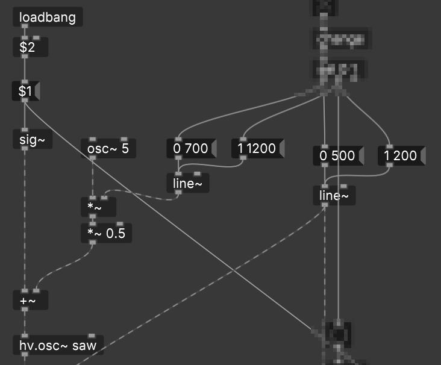
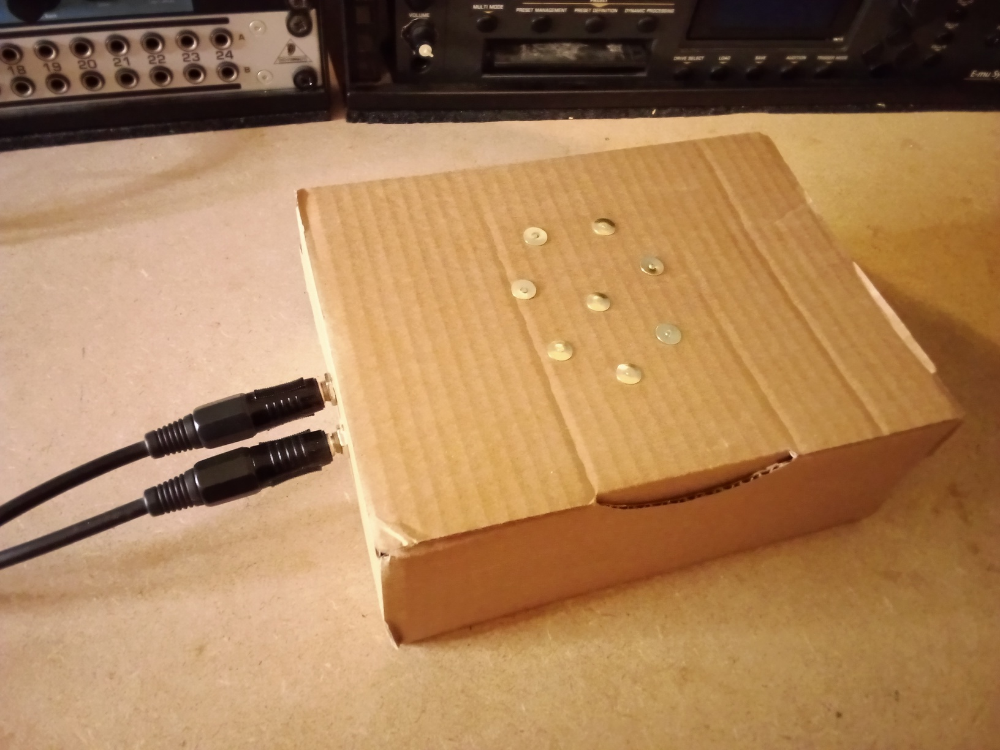

# Dattopan

A simple digital "handpan" like synth based on the Electro-Smith Daisy and the MPR121 capacitive touch sensor.

## About

Recently I visited a friend that has a company creating handpans, a modern derivative of the steelpan. So for this project I got inspired to create a kind of digital equivalent using the Daisy and the touch sensor!

The name came to be because I was initially playing with a patch based on the `dattorro` reverb algorithm. It runs very well on the Daisy Field, however when I added the MPR121 library things went south and I had to abandon the spaceous reverb effect. The name stuck around though.

The current tuning is based on a Celtic Minor scale in C# which was basically the first one I found on [this site](https://www.sarazhandpans.com/handpan-scales/).

## Patch

The main patch is just 8 instances of the `dattone.pd` voice with initialization for the touch input and frequency. Each voice is routed to either left, right or both outputs for a bit of crude panning:


The subpatch sets up a touch input in which we filter for changes in the continuous number stream and select 0 (off) or 1 (on) messages:


The main voice is a sawtooth oscillator. One envelope fades in and out some vibrato, while another modifies the main volume:



In addition when you activate the voice a little percussive hit is triggered, based on some whitenoise that is filtered to the frequency of the specific oscillator (so every voice has a unique percussion). A little exponential envelope shapes the sound:


Finally there is a lowpass filter with a bit of resonance to make the sound a bit more distinct:


## Config

There are two files needed to configure the patch.

- `dattopan_hv.json` - This file is used by Heavy and points to the board configuration and sets the type of Daisy build. In our case we use the bootloader and flash to SRAM.
- `dattopan_board.json` - This is the actual board setup and sets which system-on-module we are using. The touch controller. And the number of audio channels.

## Build

### 1. Get the source

Clone this repository and pull the libDaisy submodule:

```bash
~$ git clone https://github.com/dromer/dattopan.git
~$ cd dattopan
~$ git submodule update --init --recursive
```

### 2. Build the libDaisy toolchain

> **_NOTE:_** libDaisy requires gcc-arm-none-eabi v10.2 !

```bash
~$ cd libdaisy
~$ make
```

### 3. Convert the PD patch to C/C++

> **_NOTE:_** This requires having Python and pip installed.

Install `hvcc` and go to the root of this repository to convert the pd patch into C/C++ code:

```bash
~$ pip install hvcc
~$ hvcc dattopan.pd -n dattopan -g daisy -m dattopan_hv.json -p heavylib
```

### 4. Go to the source dir

```bash
~$ cd daisy/source/
```

### 5. Edit the header file

Open `HeavyDaisy_dattopan.hpp` and modify these 2 lines:

```cpp
    touch_config.scl = som.GetPin(11);
    touch_config.sda = som.GetPin(12);
```

Either remove them or comment them out:

```cpp
    // touch_config.scl = som.GetPin(11);
    // touch_config.sda = som.GetPin(12);
```

### 6. Install the bootloader

> **_NOTE:_** If you already have the bootloader skip this step and go straight to step 7

Put your daisy into flashing mode (press and hold boot, click reset, release boot) and program the bootloader:

```bash
~$ make program-boot
```

### 7. Build and flash the firmware

Now put your daisy into bootloader mode (click reset, then click boot), compile and upload the dattopan firmware:

```bash
~$ make
~$ make program-dfu
```

## Future

- Figure out why the MPR121 doesn't work with time-based effects (delay/reverb) and restore the original patch with dattorro reverb.
- Add controls to be able to change the scale

## Images

It's a box! The touch inputs are simple metal push-pins. It has two outputs on the side.



Everything fits on a simple protoboard with a flatcable soldered to the pins. Both the touch inputs and the audio outputs are connected to the protoboard with a separate header for easy (dis)assembly.


Only a couple connections are needed:

| Pins  | Type   | Description |
| ----- | ------ | ----------- |
| 21    | Power  | red wire    |
| 20/40 | Ground | brown and blue wires |
| 19    | Left   | output header |
| 18    | Right  | output header |
| 13    | SDA    | orange wire |
| 12    | SCL    | green wire |

Then two 4k7 pull-up resistors between SDA/SCL and 3.3v.

There is plenty of space left to place additional connections and components in the future.


The header extensions to the output and touch input sockets are bridged using some wires from spare resistor legs.


